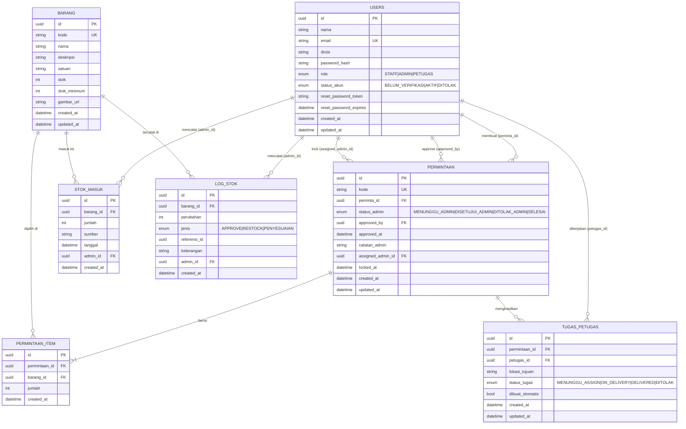

# ERD & Kamus Data — Sistem Gudang ATK

> **ERD (Entity Relationship Diagram)** = gambar yang menunjukkan **tabel-tabel database dan hubungannya**. **Kamus Data** = daftar rinci setiap kolom (tipe data, boleh kosong/tidak, arti, contoh nilai).

**Mahasiswa:** `<TODO: Nama>` · **NIM:** `<TODO>` · **Dosen Pembimbing:** `<TODO>` · **Instansi KKP:** `<TODO>`

**Sumber kebenaran:** `backend/prisma/schema.prisma` (Prisma ORM → PostgreSQL).

---

## 1. Diagram ERD (Mermaid)

> Cara lihat: buka file ini di **Cursor**, **VS Code + plugin Mermaid**, atau **GitHub**. Diagram otomatis ter-render.



### Arti Notasi Crow's Foot (singkat)
| Simbol | Arti |
|--------|------|
| `||--||` | one-to-one |
| `||--o{` | one-to-many (satu kiri punya banyak kanan) |
| `||--\|{` | one-to-many **wajib** (kanan minimal 1) |
| `}o--o{` | many-to-many (pakai tabel perantara) |

---

## 2. Ringkasan Relasi (Penjelasan Sederhana)

| Relasi | Arti Kalimat |
|--------|--------------|
| `users` → `permintaan` | 1 user (staff) bisa membuat banyak permintaan |
| `users` → `permintaan` (approved_by) | 1 admin bisa menyetujui banyak permintaan |
| `permintaan` → `permintaan_item` | 1 permintaan berisi **minimal 1** baris item |
| `barang` → `permintaan_item` | 1 barang bisa dipilih di banyak permintaan |
| `permintaan` → `tugas_petugas` | 1 permintaan menghasilkan 1 (atau lebih) tugas pengantaran |
| `users` → `tugas_petugas` (petugas_id) | 1 petugas bisa memegang banyak tugas |
| `barang` → `stok_masuk` | 1 barang bisa punya banyak catatan restock |
| `barang` → `log_stok` | 1 barang punya banyak log audit stok |

**Many-to-many** antara `permintaan` ↔ `barang` **tidak langsung**, melainkan melalui tabel perantara `permintaan_item` (memuat kolom `jumlah`).

---

## 3. Kamus Data (Data Dictionary)

> Format tabel: Nama kolom → tipe → constraint → keterangan → contoh nilai.

### 3.1 Tabel `users`

| Kolom | Tipe | Constraint | Keterangan | Contoh |
|-------|------|------------|------------|--------|
| `id` | UUID | PK, auto | Primary key | `f47ac10b-58cc-...` |
| `nama` | String | NOT NULL | Nama lengkap | `Budi Santoso` |
| `email` | String | UNIQUE, NOT NULL | Email login | `budi@kantor.com` |
| `divisi` | String | NULL | Divisi kerja (opsional) | `Keuangan` |
| `password_hash` | String | NOT NULL | bcrypt hash (≥10 rounds) | `$2b$10$...` |
| `role` | Enum | NOT NULL, default `STAFF` | Peran user | `ADMIN` |
| `status_akun` | Enum | NOT NULL, default `BELUM_VERIFIKASI` | Status verifikasi | `AKTIF` |
| `reset_password_token` | String | NULL | Token reset (sementara) | `a1b2c3...` |
| `reset_password_expires` | Timestamp | NULL | Kadaluarsa token | `2026-04-20 10:00` |
| `created_at` | Timestamp | NOT NULL | Waktu register | `2026-04-01 08:00` |
| `updated_at` | Timestamp | NOT NULL | Waktu update terakhir | `2026-04-05 14:30` |

### 3.2 Tabel `barang`

| Kolom | Tipe | Constraint | Keterangan | Contoh |
|-------|------|------------|------------|--------|
| `id` | UUID | PK | Primary key | `a1b2...` |
| `kode` | String | UNIQUE, NULL | Kode human-readable | `A-0001` |
| `nama` | String | NOT NULL | Nama barang | `Pulpen Standard AE7` |
| `deskripsi` | String | NULL | Keterangan | `Warna hitam, 0.5mm` |
| `satuan` | String | NOT NULL | Satuan pengukuran | `box`, `rim`, `buah` |
| `stok` | Integer | NOT NULL, default 0 | Stok saat ini | `120` |
| `stok_minimum` | Integer | NULL | Ambang batas (alert) | `10` |
| `gambar_url` | String | NULL | URL gambar (Supabase/local) | `https://.../barang.png` |
| `created_at` | Timestamp | NOT NULL | Waktu dibuat | `2026-04-01` |
| `updated_at` | Timestamp | NOT NULL | Waktu update | `2026-04-05` |

### 3.3 Tabel `permintaan`

| Kolom | Tipe | Constraint | Keterangan | Contoh |
|-------|------|------------|------------|--------|
| `id` | UUID | PK | Primary key | `b1c2...` |
| `kode` | String | UNIQUE, NULL | Kode bisnis (mis. `P-0001`) | `P-0042` |
| `peminta_id` | UUID | FK → `users.id`, NOT NULL | Siapa yang minta | `f47a...` |
| `status_admin` | Enum | NOT NULL, default `MENUNGGU_ADMIN` | Status dari sisi admin | `DISETUJUI_ADMIN` |
| `approved_by` | UUID | FK → `users.id`, NULL | Admin yang approve | `9f82...` |
| `approved_at` | Timestamp | NULL | Waktu approve | `2026-04-05 10:00` |
| `catatan_admin` | String | NULL | Alasan tolak / catatan | `Stok kurang` |
| `assigned_admin_id` | UUID | FK → `users.id`, NULL | Admin yang lock | `9f82...` |
| `locked_at` | Timestamp | NULL | Waktu lock (max 10 menit) | `2026-04-05 09:55` |
| `created_at` | Timestamp | NOT NULL | Waktu buat | — |
| `updated_at` | Timestamp | NOT NULL | Waktu update | — |

### 3.4 Tabel `permintaan_item`

| Kolom | Tipe | Constraint | Keterangan | Contoh |
|-------|------|------------|------------|--------|
| `id` | UUID | PK | Primary key | `c1d2...` |
| `permintaan_id` | UUID | FK → `permintaan.id` ON DELETE CASCADE | Induk permintaan | `b1c2...` |
| `barang_id` | UUID | FK → `barang.id`, NOT NULL | Barang yang diminta | `a1b2...` |
| `jumlah` | Integer | NOT NULL, ≥1 | Banyaknya | `5` |
| `created_at` | Timestamp | NOT NULL | Waktu | — |

### 3.5 Tabel `tugas_petugas`

| Kolom | Tipe | Constraint | Keterangan | Contoh |
|-------|------|------------|------------|--------|
| `id` | UUID | PK | Primary key | `d1e2...` |
| `permintaan_id` | UUID | FK → `permintaan.id` ON DELETE CASCADE | Induk permintaan | `b1c2...` |
| `petugas_id` | UUID | FK → `users.id`, NULL | Petugas yang pegang | `e3f4...` |
| `lokasi_tujuan` | String | NULL | Lokasi antar (diisi saat selesai) | `Ruang Keuangan Lt.2` |
| `status_tugas` | Enum | NOT NULL, default `MENUNGGU_ASSIGN` | Status tugas | `ON_DELIVERY` |
| `dibuat_otomatis` | Boolean | NOT NULL, default `true` | True = dibuat sistem saat permintaan approved | `true` |
| `created_at` | Timestamp | NOT NULL | — | — |
| `updated_at` | Timestamp | NOT NULL | — | — |

### 3.6 Tabel `stok_masuk`

| Kolom | Tipe | Constraint | Keterangan | Contoh |
|-------|------|------------|------------|--------|
| `id` | UUID | PK | Primary key | `f1g2...` |
| `barang_id` | UUID | FK → `barang.id` CASCADE, NOT NULL | Barang yang masuk | `a1b2...` |
| `jumlah` | Integer | NOT NULL, ≥1 | Jumlah masuk | `100` |
| `sumber` | String | NULL | Pembelian/donasi/dll | `Pembelian PT X` |
| `tanggal` | Timestamp | default now() | Tanggal masuk | `2026-04-05` |
| `admin_id` | UUID | FK → `users.id`, NOT NULL | Admin pencatat | `9f82...` |
| `created_at` | Timestamp | NOT NULL | — | — |

### 3.7 Tabel `log_stok`

| Kolom | Tipe | Constraint | Keterangan | Contoh |
|-------|------|------------|------------|--------|
| `id` | UUID | PK | Primary key | `h1i2...` |
| `barang_id` | UUID | FK → `barang.id` CASCADE | Barang | `a1b2...` |
| `perubahan` | Integer | NOT NULL | + atau − | `-5` atau `+100` |
| `jenis` | Enum | NOT NULL | `APPROVE / RESTOCK / PENYESUAIAN` | `RESTOCK` |
| `referensi_id` | UUID | NULL | ID sumber: `permintaan.id` atau `stok_masuk.id` | `b1c2...` |
| `keterangan` | String | NULL | Catatan bebas | `Selesai diantar` |
| `admin_id` | UUID | FK → `users.id`, NULL | Admin pencatat (boleh kosong kalau sistem) | `9f82...` |
| `created_at` | Timestamp | NOT NULL | — | — |

---

## 4. Daftar Enum

| Enum | Nilai | Arti |
|------|-------|------|
| `Role` | `STAFF`, `ADMIN`, `PETUGAS` | Peran user |
| `StatusAkun` | `BELUM_VERIFIKASI`, `AKTIF`, `DITOLAK` | Status verifikasi akun |
| `StatusAdmin` | `MENUNGGU_ADMIN`, `DISETUJUI_ADMIN`, `DITOLAK_ADMIN`, `SELESAI` | Status permintaan |
| `StatusTugas` | `MENUNGGU_ASSIGN`, `ON_DELIVERY`, `DELIVERED`, `DALAM_PROSES` (legacy), `SELESAI` (legacy), `DITOLAK` | Status tugas petugas |
| `JenisLogStok` | `APPROVE`, `RESTOCK`, `PENYESUAIAN` | Jenis perubahan stok |

---

## 5. Contoh Alur Data (End-to-End)

### A) Staff buat permintaan (2 rim kertas + 5 pulpen)
```
1. INSERT INTO permintaan (peminta_id, status_admin='MENUNGGU_ADMIN')
2. INSERT INTO permintaan_item (permintaan_id, barang_id='kertas', jumlah=2)
3. INSERT INTO permintaan_item (permintaan_id, barang_id='pulpen', jumlah=5)
```

### B) Admin approve
```
4. UPDATE permintaan SET status_admin='DISETUJUI_ADMIN',
                          approved_by=<adminId>,
                          approved_at=NOW()
5. INSERT INTO tugas_petugas (permintaan_id, status_tugas='MENUNGGU_ASSIGN',
                              dibuat_otomatis=true)
```

### C) Petugas ambil & selesaikan (transaction)
```
6. UPDATE tugas_petugas SET petugas_id=<petugasId>,
                           status_tugas='ON_DELIVERY'
7. -- Saat selesai:
   UPDATE tugas_petugas SET status_tugas='DELIVERED',
                           lokasi_tujuan='Ruang Keuangan'
8. UPDATE barang SET stok = stok - 2 WHERE id='kertas'
9. UPDATE barang SET stok = stok - 5 WHERE id='pulpen'
10. INSERT INTO log_stok (barang_id='kertas', perubahan=-2,
                          jenis='APPROVE', referensi_id=<permintaanId>)
11. INSERT INTO log_stok (barang_id='pulpen', perubahan=-5,
                          jenis='APPROVE', referensi_id=<permintaanId>)
12. UPDATE permintaan SET status_admin='SELESAI'
```

### D) Admin restock (100 rim kertas)
```
13. INSERT INTO stok_masuk (barang_id='kertas', jumlah=100,
                            sumber='Pembelian', admin_id=<adminId>)
14. UPDATE barang SET stok = stok + 100 WHERE id='kertas'
15. INSERT INTO log_stok (barang_id='kertas', perubahan=+100,
                          jenis='RESTOCK', referensi_id=<stokMasukId>,
                          admin_id=<adminId>)
```

Semua langkah 6–12 dan 13–15 **dibungkus dalam satu transaction** (atomic) agar konsisten.

---

## 6. Index & Performa (Saran)

Kolom yang sering dipakai di `WHERE` — baik buat **index** untuk kecepatan:

| Tabel | Kolom | Alasan |
|-------|-------|--------|
| `users` | `email` | Login lookup (sudah UNIQUE) |
| `permintaan` | `peminta_id`, `status_admin`, `created_at` | Filter list permintaan |
| `permintaan_item` | `permintaan_id`, `barang_id` | Join & lookup |
| `tugas_petugas` | `permintaan_id`, `petugas_id`, `status_tugas` | Filter daftar tugas |
| `log_stok` | `barang_id`, `created_at` | Laporan per periode |
| `stok_masuk` | `barang_id`, `tanggal` | Riwayat restock |

> Prisma otomatis buat index untuk FK, tapi index **composite** (mis. `(status_admin, created_at)`) bisa ditambahkan manual lewat migration kalau query sudah terasa lambat.
