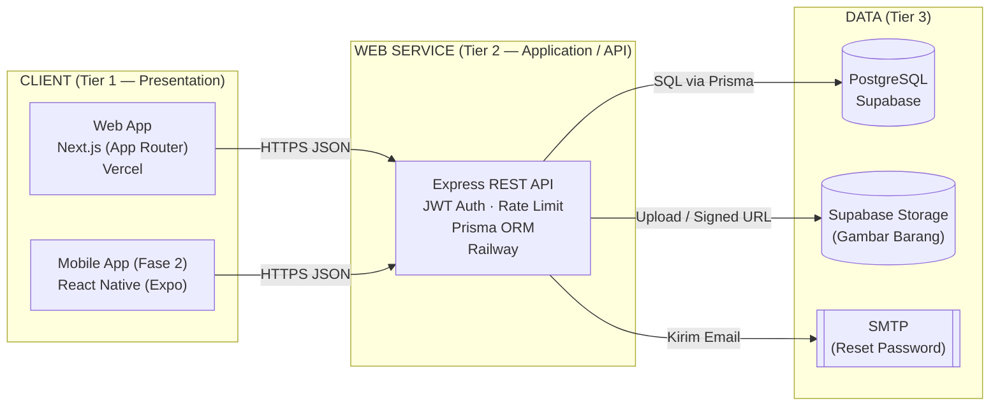
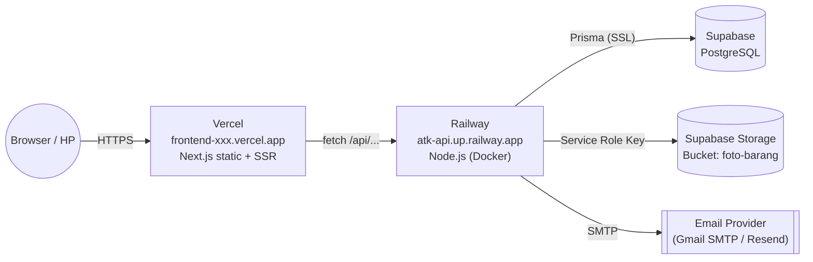

# Arsitektur Sistem — Gudang ATK

> Dokumen ini menjelaskan **bagaimana potongan sistem terhubung** dan **di mana tiap bagian berjalan**. Cocok untuk BAB III laporan KKP.

**Mahasiswa:** `<TODO: Nama>` · **NIM:** `<TODO>` · **Dosen Pembimbing:** `<TODO>` · **Instansi KKP:** `<TODO>`

---

## 1. Pola Arsitektur: 3-Tier (Client–Server–Database)



### Penjelasan Tiap Tier
| Tier | Nama | Peran | Teknologi |
|------|------|-------|-----------|
| 1 | **Presentation** | UI untuk user (Staff/Admin/Petugas) | Next.js + React + CSS, (Fase 2: React Native) |
| 2 | **Application / Web Service** | Logic bisnis + endpoint REST | Node.js + Express + Prisma + JWT |
| 3 | **Data** | Penyimpanan permanen | PostgreSQL (Supabase) + Supabase Storage |

---

## 2. Komponen Backend (Express)

```mermaid
flowchart TB
  REQ([HTTP Request]) --> CORS[CORS + Rate Limit]
  CORS --> AUTH{requireAuth?}
  AUTH -- "ya" --> VERIFY[Verify JWT] --> ROLE{requireRole?}
  AUTH -- "tidak" --> CTL
  ROLE -- "ok" --> CTL[Controller]
  ROLE -- "gagal" --> ERR403[403 Forbidden]
  VERIFY -- "invalid" --> ERR401[401 Unauthorized]
  CTL --> SVC[Service / Business Logic]
  SVC --> PRISMA[(Prisma Client)]
  PRISMA --> DB[(PostgreSQL)]
  CTL --> RESP([JSON Response<br/>{success, message, data}])
```

### Struktur Folder Backend
```
backend/
├── prisma/
│   ├── schema.prisma         # Definisi model/tabel (sumber kebenaran)
│   └── seed.js               # Data awal (admin, dll)
├── src/
│   ├── server.js             # Entry point: Express + middleware + routes
│   ├── config/
│   │   └── database.js       # Instansiasi Prisma Client
│   ├── middleware/
│   │   └── authMiddleware.js # requireAuth, requireRole
│   ├── routes/
│   │   ├── authRoutes.js     # /api/auth/*
│   │   ├── barangRoutes.js   # /api/barang/*
│   │   ├── permintaanRoutes.js
│   │   ├── restockRoutes.js
│   │   ├── logStokRoutes.js
│   │   ├── laporanRoutes.js
│   │   ├── adminRoutes.js
│   │   └── uploadRoutes.js
│   ├── controllers/          # Handler tiap endpoint
│   ├── services/
│   │   └── storageUpload.js  # Upload ke Supabase Storage / lokal
│   └── utils/
│       ├── jwt.js            # sign / verify JWT
│       └── response.js       # successResponse / errorResponse
└── uploads/                  # Fallback storage lokal (dev)
```

### Alur Request Standar
1. Request masuk di `server.js` → kena `globalLimiter` (rate limit).
2. Cek CORS (boleh dari `localhost`, `*.vercel.app`, atau `FRONTEND_URL`).
3. Masuk ke **route** yang cocok → pasang `requireAuth` (cek JWT) + `requireRole(['ADMIN'])` bila perlu.
4. **Controller** baca/tulis DB lewat **Prisma Client**.
5. Balikan response format konsisten: `{ success, message, data }`.

---

## 3. Komponen Frontend (Next.js)

```
frontend/
├── app/
│   ├── login/                    # Halaman publik
│   ├── forgot-password/
│   ├── reset-password/
│   └── (app)/                    # Route group — butuh login
│       ├── layout.js             # Shell layout (sidebar, header)
│       ├── dashboard/            # Admin overview
│       ├── barang/               # Katalog (semua role)
│       ├── permintaan/           # List + buat permintaan
│       ├── pengeluaran/
│       ├── restock/              # Admin only
│       ├── log-stok/             # Admin only
│       ├── laporan/              # Admin only
│       ├── users/                # Admin only
│       ├── notifikasi/
│       ├── profil/
│       └── pengaturan/
├── components/
│   ├── layout/                   # Navbar, sidebar
│   └── ui/                       # Tombol, form, modal, dll
└── lib/                          # Fetch wrapper, helper
```

**Prinsip:** Frontend **hanya** menampilkan UI & memanggil API. **Tidak** ada logika bisnis (kecuali validasi ringan UI). Token JWT disimpan di `localStorage` atau `cookie httpOnly` (implementasi detail proyek).

---

## 4. Arsitektur Deployment (Production)



### Variabel Lingkungan Penting (`.env` — lihat `backend/ENV_SETUP.md`)

| Key | Isi | Di mana |
|-----|-----|---------|
| `DATABASE_URL` | URL connection PostgreSQL (pool) | Backend |
| `DIRECT_URL` | URL connection langsung (untuk migration) | Backend |
| `JWT_SECRET` | Rahasia tanda tangan JWT | Backend |
| `JWT_EXPIRES_IN` | `7d` atau `1d` | Backend |
| `FRONTEND_URL` | `https://frontend-xxx.vercel.app` (CORS + link email) | Backend |
| `SUPABASE_URL` | `https://<project>.supabase.co` | Backend |
| `SUPABASE_SERVICE_ROLE_KEY` | Key service role (rahasia server) | Backend |
| `SUPABASE_STORAGE_BUCKET` | `foto-barang` | Backend |
| `SMTP_HOST`, `SMTP_PORT`, `SMTP_USER`, `SMTP_PASS` | Kredensial SMTP | Backend |
| `NEXT_PUBLIC_API_URL` | URL backend (dipakai di Next.js) | Frontend |

### Alur CI/CD Sederhana
1. **Push code** → GitHub.
2. **Vercel** auto-build frontend dari branch `main`.
3. **Railway** auto-build backend dari branch `main` (pakai `Dockerfile` di root).
4. Migration Prisma dijalankan manual saat ada perubahan schema: `npx prisma migrate deploy`.

---

## 5. Security Design

| Ancaman | Mitigasi |
|---------|----------|
| Brute force login | Rate limit `10 req/15 menit/IP` + password di-hash bcrypt |
| Token dicuri | JWT expire singkat (`7d`), `reset_password_token` expire 1 jam |
| SQL Injection | Prisma parameterized query (aman by default) |
| XSS | React escape default + validasi input di API |
| CORS abuse | Whitelist `localhost`, `*.vercel.app`, `FRONTEND_URL` |
| Role escalation | Middleware `requireRole` wajib di endpoint admin/petugas |
| File upload berbahaya | Validasi mime type + ukuran di `storageUpload.js` |

---

## 6. Diagram Komunikasi Antar Komponen (Contoh: Buat Permintaan)

```mermaid
sequenceDiagram
  autonumber
  participant U as Staff (Browser)
  participant F as Next.js (Vercel)
  participant A as Express API (Railway)
  participant D as Postgres (Supabase)

  U->>F: Klik "Buat Permintaan"
  F->>A: POST /api/permintaan<br/>Authorization: Bearer <jwt>
  A->>A: requireAuth (verify JWT)
  A->>A: Validasi items[] (barangId + jumlah)
  A->>D: BEGIN; INSERT permintaan; INSERT permintaan_item; COMMIT
  D-->>A: row inserted
  A-->>F: 201 { success:true, data:{ permintaan } }
  F-->>U: Tampilkan notif "Berhasil!"
```

---

## 7. Skalabilitas & Cadangan

- **Scaling horizontal**: Railway bisa tambah instance; Express *stateless* (JWT, bukan session). Asal tidak ada state in-memory, scaling aman.
- **Backup DB**: Supabase punya backup harian otomatis (Pro plan) atau `pg_dump` manual via script.
- **Monitoring**: Railway logs + `console.log` request pada `server.js`.

---

**Gambar yang dimasukkan ke laporan KKP:**
1. Diagram 3-tier (bagian 1) → BAB III.
2. Diagram deployment (bagian 4) → BAB III.
3. Sequence diagram (bagian 6) → BAB IV (implementasi).
