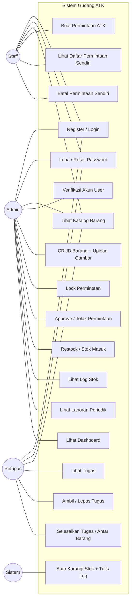
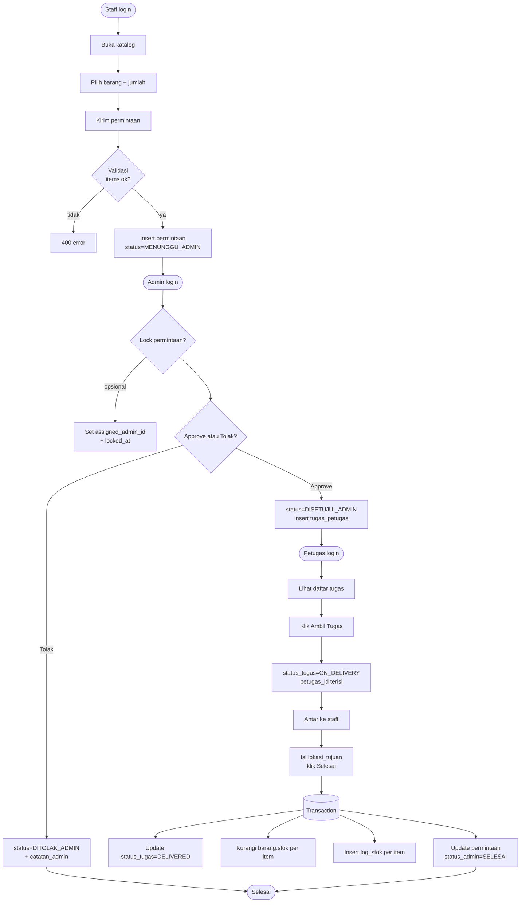
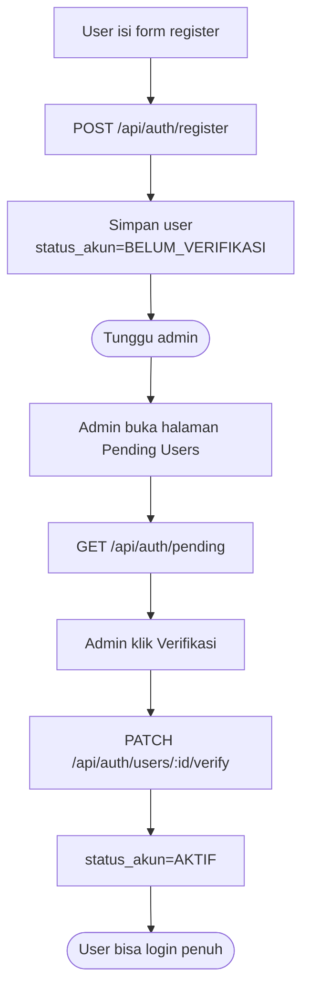
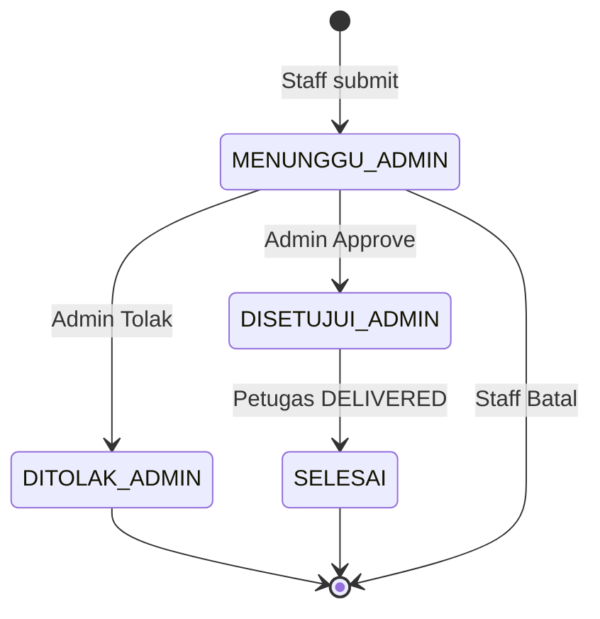
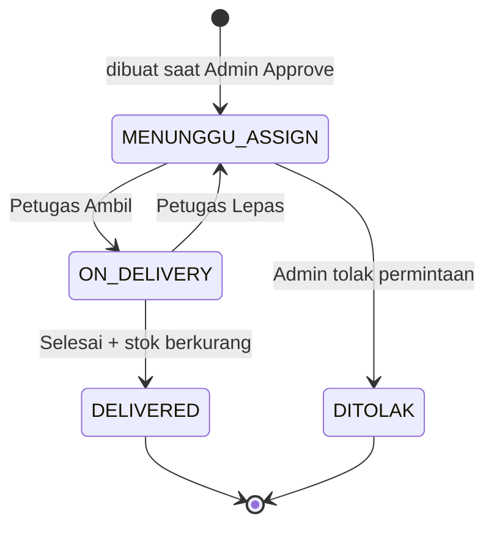

# Use Case & Alur Sistem — Gudang ATK

> **Use Case** = daftar "apa yang bisa dilakukan user di sistem". **Alur (Flowchart)** = gambaran langkah yang terjadi saat fitur dijalankan.

**Mahasiswa:** `<TODO: Nama>` · **NIM:** `<TODO>` · **Dosen Pembimbing:** `<TODO>` · **Instansi KKP:** `<TODO>`

---

## 1. Use Case Diagram

---

## 2. Use Case Detail (Format Tabel)

### UC-04: Buat Permintaan ATK (Staff)

| Atribut | Isi |
|---------|-----|
| **Aktor Utama** | Staff |
| **Pra-kondisi** | User login + `status_akun = AKTIF` |
| **Pasca-kondisi** | Baris baru di `permintaan` + ≥1 di `permintaan_item`, status `MENUNGGU_ADMIN` |
| **Main Flow** | 1. Staff buka halaman "Buat Permintaan" 2. Pilih barang + isi jumlah (ulang untuk multi-item) 3. Klik "Kirim" 4. Sistem validasi `items[]` tidak kosong & jumlah ≥ 1 5. Sistem simpan ke DB dan balikan sukses |
| **Alternative Flow** | 4a. Item kosong → 400 *"Minimal satu item barang"* 4b. `barangId` tidak valid → 400 |
| **Endpoint** | `POST /api/permintaan` |

### UC-10: Approve / Tolak Permintaan (Admin)

| Atribut | Isi |
|---------|-----|
| **Aktor Utama** | Admin |
| **Pra-kondisi** | Permintaan `MENUNGGU_ADMIN` + (opsional) sudah di-lock admin ini |
| **Pasca-kondisi** | `status_admin` ter-update; jika approve → `tugas_petugas` dibuat otomatis |
| **Main Flow** | 1. Admin buka daftar permintaan 2. Admin klik "Lock" (opsional, max 10 menit) 3. Admin klik **Approve** atau **Tolak** + isi catatan bila tolak 4. Sistem update `status_admin`, isi `approved_by`, `approved_at` 5. Jika approve → insert `tugas_petugas` dengan `status = MENUNGGU_ASSIGN` 6. Response sukses |
| **Alternative Flow** | 3a. Permintaan sudah di-lock admin lain < 10 menit → 409 *"Sedang diproses admin lain"* |
| **Endpoint** | `PATCH /api/permintaan/:id/approve` |

### UC-17: Selesaikan Tugas (Petugas)

| Atribut | Isi |
|---------|-----|
| **Aktor Utama** | Petugas |
| **Pra-kondisi** | Tugas `ON_DELIVERY` dan `petugas_id = user ini` |
| **Pasca-kondisi** | `status_tugas = DELIVERED`, `barang.stok` berkurang, `log_stok` tercatat, `permintaan.status_admin = SELESAI` |
| **Main Flow** | 1. Petugas buka tugas yang sedang dipegang 2. Isi `lokasi_tujuan` 3. Klik "Selesai" 4. Sistem bungkus dalam transaction:   a. Update status tugas   b. Kurangi stok tiap item (loop)   c. Insert log_stok tiap item (`jenis=APPROVE`)   d. Update `permintaan.status_admin = SELESAI` 5. Response sukses |
| **Alternative Flow** | 4b. Stok kurang dari jumlah permintaan → rollback, 400 *"Stok tidak cukup"* |
| **Endpoint** | `PATCH /api/permintaan/tugas/:id` |

### UC-11: Restock (Admin)

| Atribut | Isi |
|---------|-----|
| **Aktor Utama** | Admin |
| **Pasca-kondisi** | `stok_masuk` +1 baris, `barang.stok` bertambah, `log_stok` +1 baris (`jenis=RESTOCK`) |
| **Endpoint** | `POST /api/restock` |

*(Use case lain mengikuti pola yang sama. Untuk laporan, 3 use case detail di atas sudah mewakili "alur utama" sistem.)*

---

## 3. Flowchart Alur Utama (End-to-End)

---

## 4. Flowchart Alur Auth (Register → Verifikasi)

---

## 5. State Diagram — Permintaan

---

## 6. State Diagram — Tugas Petugas

---

## 7. Ringkasan Matriks Akses (Role × Use Case)

| Use Case | STAFF | ADMIN | PETUGAS |
|----------|:-----:|:-----:|:-------:|
| Register / Login | ✓ | ✓ | ✓ |
| Lihat Katalog | ✓ | ✓ | ✓ |
| Buat Permintaan | ✓ | ✓ | ✓ |
| Batal Permintaan Sendiri | ✓ | — | — |
| CRUD Barang | — | ✓ | — |
| Verifikasi User | — | ✓ | — |
| Approve / Tolak | — | ✓ | — |
| Lock Permintaan | — | ✓ | — |
| Restock | — | ✓ | — |
| Log Stok | — | ✓ | — |
| Laporan | — | ✓ | — |
| Dashboard | — | ✓ | — |
| Kelola User | — | ✓ | — |
| Lihat Tugas | — | ✓ (read) | ✓ |
| Ambil / Lepas Tugas | — | — | ✓ |
| Selesaikan Tugas | — | — | ✓ |
